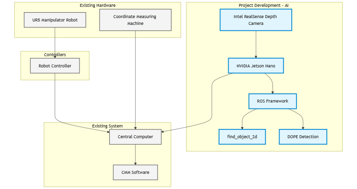

*This is a template repository for this organization. Start by replacing the placeholder for the project name with its actual title.*

# AI-based Quality Assurance and Control System for Enhancing a Coordinate Measuring Machine with Machine Vision. 

## Summary
| Company Name | [ProtoLab OÜ](https://protolab.io) |
| :--- | :--- |
| Development Team Lead Name | [Karl Kruusamäe](https://www.etis.ee/CV/Karl_Kruusamae/eng) |
| Development Team Lead E-mail | [karl.kruusamae@ut.ee](mailto:karl.kruusamae@ut.ee) |
| Duration of the Demonstration Project | 12/2023-10/2024 |
| Final Report | [final_report.pdf](./files/final_report.pdf) |

# Description
## Objectives of the Demonstration Project

The primary objective of this demonstration project was to test and validate an AI-based quality control system that enables optimal utilization of industrial coordinate measuring machines (CMM), including empowering manufacturing companies with a fully autonomous (robotized) specimen loading system. The project aimed to validate a system capable of measuring 100% of products with minimal human intervention and system reconfiguration requirements.

## Activities and Results of the Demonstration Project
### Challenge

The demonstration project addressed a key challenge in high-mix, low-volume manufacturing environments, where small and medium-sized enterprises (SMEs) produce diverse products in small batches. The primary challenge was the inefficient quality control process that relied either on manual inspection or coordinate measuring machines (CMM). When using CMM, each unique part required custom fixtures and machine reconfiguration, making the quality control process disproportionately time-consuming and costly for small batch productions.

The market lacked an automated solution where a CMM could identify parts, detect their position, and initiate appropriate measurement programs without manual setup. This technological gap drove the development of our AI-based solution, with the core challenge remaining consistent throughout the project's duration.

### Data Sources
The project relied on two types of data sources:

1. Real-world Data
   - Custom dataset collected specifically during the project implementation
   - Captured images of actual parts under various measurement conditions

2. Synthetic Training Data
   - Generated using DOPE repository scripts
   - Approximately 20,000 synthetic images per training set
   - Generation process typically required 12+ hours of computation time
   - Synthetic data proved sufficient for initial model training and validation

### AI Technologies
The project implemented two AI-based approaches for part detection and positioning:

1. Computer Vision-based Solution (Find Object ROS) 
   - Traditional image processing algorithms for object detection
   - Suitable for controlled environments with consistent lighting
   - Requires minimal training but needs careful calibration

2. Deep Learning Solution (DOPE) 
   - Advanced neural network architecture for precise pose estimation
   - More robust against environmental variations
   - Requires substantial training data but offers better generalization

The AI technology was specifically chosen to eliminate the need for mechanical fixtures and extensive operator training. By integrating AI-based part detection and positioning with the coordinate measuring machine, the system automatically provides necessary instructions and initial conditions for measurements and report generation. This technological choice was justified by its ability to:
- Automate part recognition and positioning
- Reduce setup time between different product types
- Minimize human intervention in the measurement process
- Enable flexible quality control for diverse product lines

### Technological Results
The two implemented approaches were extensively tested, revealing distinct advantages and limitations:
1. Find Object Approach 
   - Quick implementation with minimal setup time for new objects
   - Performance varied significantly between different object types: 
     - Simple objects (e.g., Gear): Reliable detection with single reference image
     - Complex objects (e.g., Fork): Required multiple reference images
   - Key limitations identified: 
     - High sensitivity to light reflections on metallic surfaces
     - Poor performance with objects lacking distinct surface features
     - Detection reliability heavily dependent on consistent lighting conditions

2. DOPE (Deep Object Pose Estimation) Approach 
   - Demonstrated more robust detection capabilities
   - Implementation challenges: 
     - Extensive preparation time required
     - Resource-intensive model training process
     - Data generation requirements disproportionate to final tool quality
   - Cost-benefit analysis indicated that the current implementation may be impractical for rapid deployment in high-mix manufacturing environments

The testing phase concluded that while both approaches are technically viable, further optimization would be needed for industrial-scale implementation, particularly in environments requiring frequent introduction of new parts.

### Technical Architecture

### User Interface 
During this demonstration project, the focus remained on validating the core technological solution rather than developing a dedicated user interface. The interaction with the system was facilitated through:

1. Existing Tool Interfaces 
   - Native GUI of the coordinate measuring machine
   - ROS-based visualization tools for pose estimation validation
   - Command-line interface for system configuration and control
2. Development Environment 
   - Direct command-line access for testing and debugging
   - Visualization tools for real-time pose estimation results
   - Standard output for system status and measurements

While a production-ready interface was not part of this project's scope, the successful validation of core functionalities provides a solid foundation for future user interface development that could include:
- Integration with existing ERP systems
- Custom GUI for operator interaction
- Automated reporting dashboard
- Real-time monitoring interface

### Future Potential of the Technical Solution
While initially developed for CMM-based quality control, the AI-based object detection and pose estimation system demonstrates potential for broader industrial applications:

1. Manufacturing Operations 
   - Automated pick-and-place operations in flexible production lines
   - Quality control integration in various manufacturing processes
   - Assembly line automation with mixed product variants
   - Part sorting and classification in production environments

2. Warehouse and Logistics 
   - Automated inventory management of unstructured stock
   - Intelligent bin picking systems for order fulfillment
   - Mixed-item package handling and sorting
   - Automated loading/unloading operations

3. Robotics Applications 
   - General-purpose robotic grasping systems
   - Collaborative robot implementations
   - Flexible automation cells
   - Multi-purpose robotic workstations

4. Quality Control Integration 
   - Integration with other measurement and inspection systems
   - Automated defect detection systems
   - In-line quality verification processes
   - Material handling in testing facilities

The solution's ability to handle varied objects makes it particularly valuable in environments requiring flexible automation and precise object manipulation.

### Lessons Learned
The demonstration project successfully validated the technical feasibility of AI-based quality control automation, while also revealing important insights for future implementations:

Key Successes:
- Confirmed the viability of AI-powered part detection and positioning for CMM applications
- Successfully demonstrated automated measurement program selection
- Proved the concept of fixture-free quality control for diverse parts

Critical Challenges:
- Object library expansion requires significant effort and technical expertise
- Current workflow for introducing new parts is not optimized for production environments
- Time investment for training varies significantly between different part types

Areas for Improvement:
- Need for streamlined tools and processes for adding new parts to the system
- Requirement for more user-friendly interfaces for quality control personnel
- Opportunity to optimize the balance between setup time and detection reliability

While the core technology demonstrates strong potential for solving the initial challenge of flexible quality control automation, the project highlighted the importance of developing supporting tools and workflows for practical industrial deployment.
